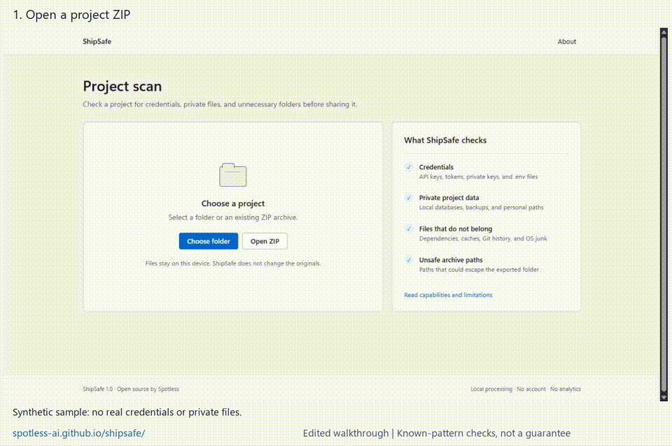

# Try ShipSafe with a sample project

[Open the app](https://spotless-ai.github.io/shipsafe/) · [Download sample ZIP](https://github.com/Spotless-ai/shipsafe/raw/refs/heads/main/docs/first-trial/shipsafe-sample-project.zip)

This small, synthetic five-file project lets you try the workflow without sharing private files or using real credentials. The fixture and walkthrough are covered by the repository's MIT license. No third-party code or media is included in the sample.

1. Download the sample and choose **Open ZIP** in ShipSafe.
2. Read each finding and decide what belongs in the exported project.
3. Select **Create reviewed ZIP**.
4. Open the downloaded ZIP and inspect its contents. You do not need to execute any code.

With the default exclusions, the current version flags `.env` (dummy credential), `node_modules/example/index.js` (synthetic dependency placeholder), and `.DS_Store` (synthetic OS-junk placeholder). The exported ZIP should contain exactly `README.md` and `src/hello.js`, unchanged. The original ZIP stays unchanged.

This exact workflow was checked on the live app on 2026-08-30, and the downloaded archive's two file contents matched the original bytes. That is one controlled test, not external user validation or proof that arbitrary projects are safe. Patterns can miss secrets and flag harmless values, including this fixture's deliberately fake credential. Binary contents are not interpreted.

## Feedback that helps

If you try it, a reply with these three things is enough:

- Your browser and operating system.
- Whether you could finish scan → review → export → inspect, and where you got stuck.
- Whether the findings helped you decide what to share, and what was confusing.

[Open a GitHub issue](https://github.com/Spotless-ai/shipsafe/issues) or reply wherever you found the invitation. Feedback is optional. Do not send private ZIPs, credentials, private paths or identifying screenshots. There is no tracking or account requirement in the app; GitHub requires an account to submit an issue.

## Walkthrough

[20-second MP4](shipsafe-workflow.mp4). These are actual browser screenshots assembled into an edited walkthrough with reading pauses and captions. The result was independently checked from the downloaded archive. No UI results, user metrics or credentials were invented.
